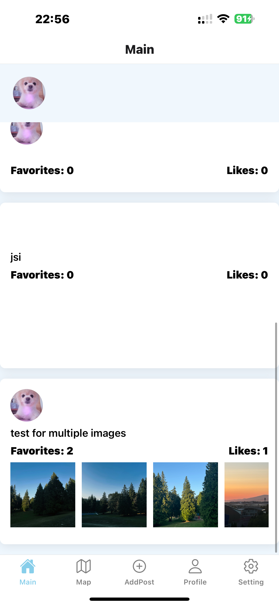

# Voyage Vista - Travel Companion App

## Project Overview

Voyage Vista is a React Native app designed to enhance the travel experience by allowing users to explore destinations, capture and share memorable moments, and manage travel itineraries efficiently.

## App Functionality

- **Map Integration:** Interactive maps with location markers for user-visited and suggested travel spots.
- **Camera Functionality:** Users can take pictures at destinations and upload them to the app.
- **Notifications:** Users receive notifications related to weather updates for selected cities or locations.
- **Location Functionality:** The app includes features that allow users to add location data to their posts, enhancing the travel experience by providing geographical context.
- **Weather Information:** Integration with the OpenWeather API allows the app to display weather information for selected cities, helping users plan their travels effectively.
- **CRUD Operations:** Users can create, read and delete information related to their travel experiences and create, read, update their profile.

## Data Model and Firebase Collections

### Firestore Collections

- **Users:** Stores user profile information and their interactions with posts.

  - **Fields:**
    - `userId`: Unique identifier for the user.
    - `username`: Username of the user.
    - `email`: Email address of the user.
    - `profilePicture`: URL of the user's profile picture.
    - `birthday`: The Date time of the user's birthday.
    - `posts`: Array of post IDs created by the user.
    - `favorites`: Array of post IDs favorited by the user.
    - `likes`: Array of post IDs liked by the user.

  - **CRUD Operations:**
    - **Create:** On signup
    - **Read:** Profile view
    - **Update:** Edit profile, manage arrays (add/remove post IDs, favorite post IDs, liked post IDs, comment IDs)

- **Posts:** Collection of travel posts created by users.

  - **Fields:**
    - `userId`: Identifier of the user who created the post.
    - `destination`\*: Destination mentioned in the post.
    - `addressType`: Whether it is a city or precise address.
    - `pictureUrl`: URL of the picture related to the post.
    - `createdAt`: Time when the post was created.
    - `coordinates`: Geographical coordinates of the destination.
    - `favoritesCount`: Number of times the post has been favorited.
    - `likesCount`: Number of times the post has been liked.
    - `favoritedBy`: Array of user IDs who have favorited the post.
    - `likedBy`: Array of user IDs who have liked the post.

  - **CRUD Operations:**
    - **Create:** Post creation
    - **Read:** View posts
    - **Update:** Increment likes and favorites
    - **Delete:** Delete post

  - **Subcollections:**
    - **Comments:** Stores comments related to the post.
      - **Fields:**
        - `userId`: Identifier of the user who made the comment.
        - `content`: The text of the comment.
        - `timestamp`: Time when the comment was made.
      - **CRUD Operations:**
        - **Create:** Add comment
        - **Read:** View comments
        - **Delete:** Delete comment

### Firebase Storage Structure

- **Posts Folder:** 
  - **Structure:** `posts/{postId}`
  - **Description:** Contains all pictures related to specific posts.
  - **Usage:** When users create a post and upload pictures, the images are stored in this folder under a subfolder named after the post ID.

- **Profile Pictures Folder:** 
  - **Structure:** `profile_pictures/`
  - **Description:** Stores profile pictures of all users.
  - **Usage:** When users upload or change their profile picture, the image is stored in this folder.

## Contributions

### Team Members:

- Shirui Chen
- Kai Zong

### Contributions Summary:

- **Shirui Chen:** Set up the initial project structure and navigation using React Navigation. Complete some screen functionality coding and styling. Further implement album and camera functionality when users add posts. Complete notification functionality and display the weather information of the selected city retrieved from the external OpenWeather API. [Login screen, Signup screen, Setting screen, Profile screen, Favorites screen, Map Screen]

- **Kai Zong:** Implemented the authentication and connection flow with Firebase Firestore database and Firebase Storage, and CRUD operations in applications. Complete some screen functionality coding and styling. Further implement location functionality when users add posts and in map screen, and the display of post summaries of posts located in the mapView in the Map Screen. [Main screen, Post Details screen, Add Post screen, Map screen, Weather Details screen]

## Screenshots

_Caption: Updated Main screen showing the list of users' posts._

## Version Control and Collaboration

All team members have cloned the repository, created their own branches for features, and merged their changes into the main branch after review. Regular commits and pulls ensure that everyone has the latest updates.

### Note on Contributions

If there are any contributions not directly reflected in GitHub commits (e.g., planning and design discussions), they are noted here along with the responsible team members.
